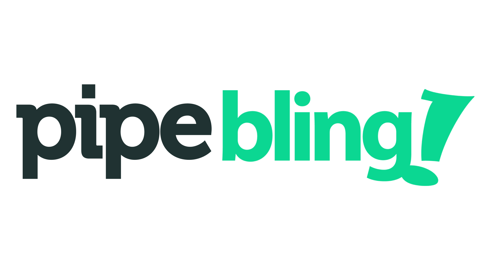

<p align="center">
  
  <p align="center">
    An integration system between Pipedrive and Bling
  </p>
</p>

### **Temporary links**
check the documentation before testing the API
<br/>
<br/>
**API**: http://ec2-18-188-127-16.us-east-2.compute.amazonaws.com/
<br />
**Documentation**: http://ec2-18-188-127-16.us-east-2.compute.amazonaws.com:8080
<br />
<br />

## Install the dependencies
- Using npm
  ```bash
    npm i
  ```
- Using yarn
  ```bash
    yarn
  ```
## Configuring mongodb
If you do not have a Mongo Atlas account, install a version of mongodb locally or use the docker.

If you have the docker, run the command:
```
  docker run -d --name mongodb -p 27017:27017 mongo
```

To configure the connection URL (locally/docker or mongo atlas), just change in the  `config/default.json` file the value of the `mongoUrl` property (the default value is based on the docker command and probably to install the mongo on the own machine)
```json
...
  "database": {
    "mongoUrl": "mongodb://localhost:27017/pipebling"
  },
...
```
## Configuring pipedrive and bling API KEY
To obtain the API KEY in the Bling you will need to create an user API type and the token will automatically be displayed, [See this link](https://ajuda.bling.com.br/hc/pt-br/articles/360035558634-Usu%C3%A1rio-e-Usu%C3%A1rio-API).

At pipedrive, create an account and access this url `https://<your_company>.pipedrive.com/settings/api` by changing the value of `<your_company>` by what was generated to view the KEY API

With the two API KEY, just change the token fields of each service in the `config/default.json` file:
```json
...
  "pipedrive": {
    "url": "https://api.pipedrive.com/v1",
    "token": "token-mock"
  },
  "bling": {
    "url": "https://bling.com.br/Api/v2",
    "token": "token-mock"
  },
...
```

## Run the build command
```
npm run build
```

## Run the api
```
npm start
```

## To run the documentation
Go to the `docs` directory and run:
```
npm i && npm start
```
